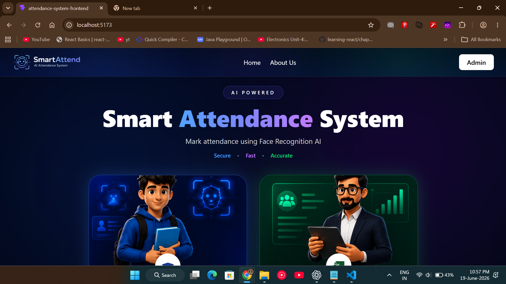
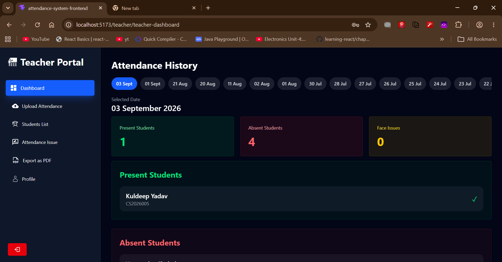
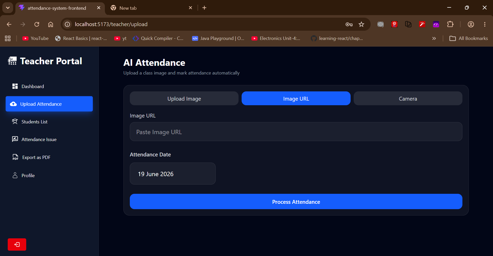
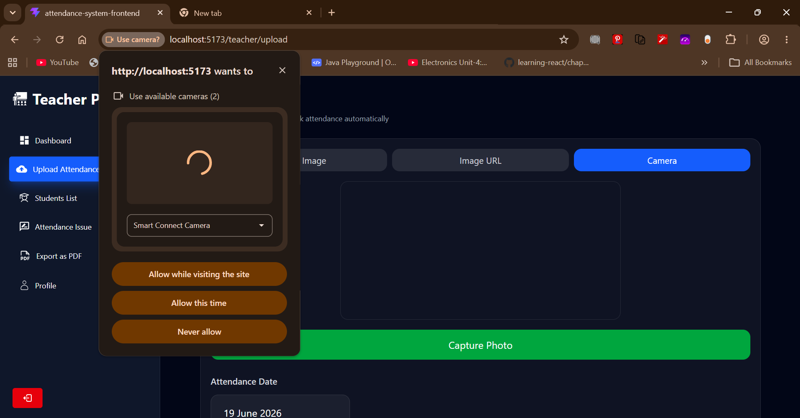
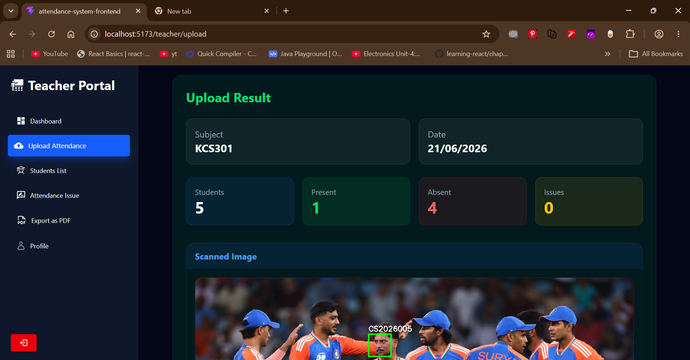
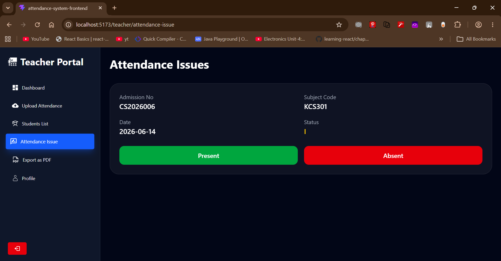
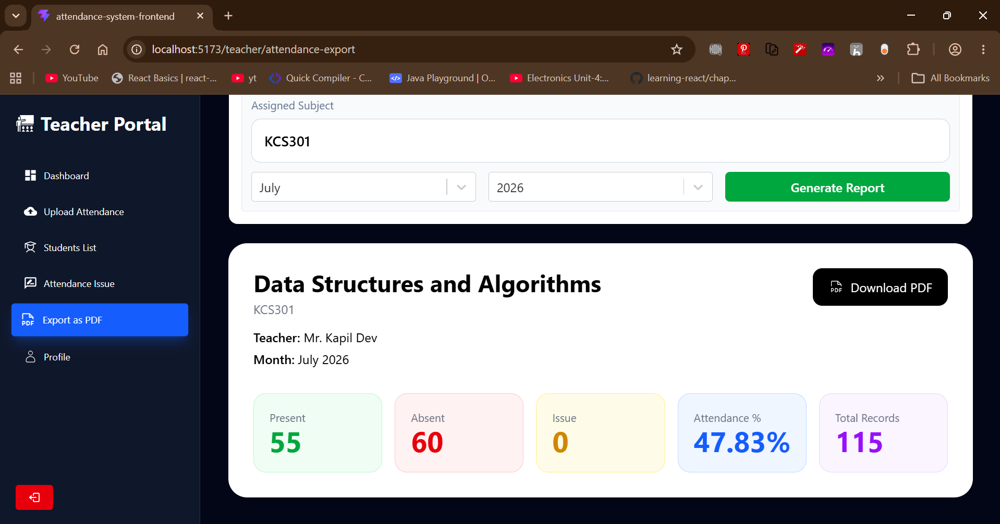
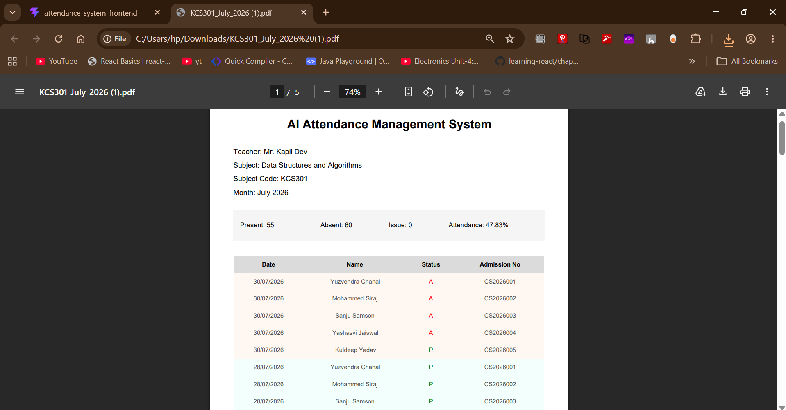
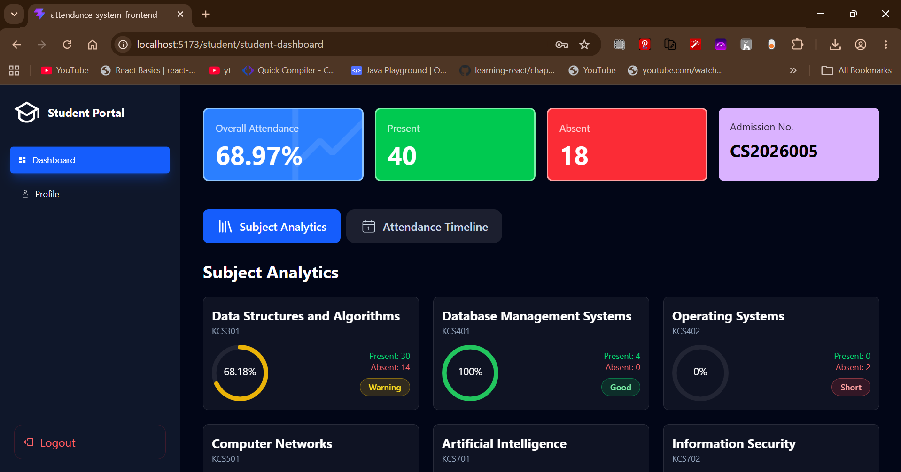
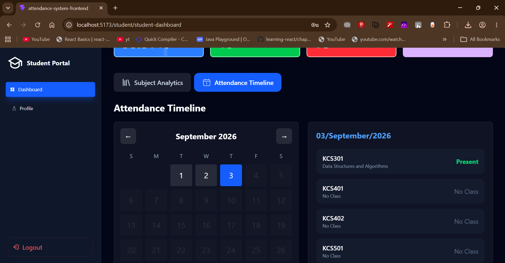

# AI Attendance Management System

🚀 An AI-Powered Attendance Management System that automates attendance tracking using Face Recognition and Computer Vision. The platform provides dedicated portals for Admins, Teachers, and Students while reducing manual workload, improving accuracy, and generating attendance analytics and reports.

---

## 🌐 Live Demo

🔗 **Demo Link:**  https://ai-attendance-management-system-xi.vercel.app

---

# 📸 Screenshots

### 🏠 Home Page



---

### 👨‍🏫 Teacher Dashboard



---

### 📤 Attendance Upload



---

### 📷 Live Camera Attendance



---

### 🤖 AI Face Recognition Result



---

### ⚠️ Attendance Issue Management



---

### 📄 PDF Report Generator



---

### 📑 Generated PDF Report



---

### 🎓 Student Analytics Dashboard



---

### 📅 Attendance Timeline




## 📌 Overview

AI Attendance Management System is a web-based platform designed for schools and colleges to automate attendance management using Face Recognition technology.

The system automatically identifies students from classroom images and marks attendance while providing powerful analytics and reporting tools.

The platform consists of three dedicated portals:

- Admin Portal
- Teacher Portal
- Student Portal

---

## 🎯 Problem Statement

Traditional attendance systems are time-consuming, prone to human errors, and difficult to manage in large classrooms.

This project solves these challenges by:

- Automating attendance using AI-based face recognition
- Reducing manual attendance workload
- Providing role-based access control
- Generating attendance reports automatically
- Allowing teachers to manually resolve attendance issues
- Providing attendance analytics and insights to students
- Maintaining centralized student and teacher records

---

## ✨ Key Features

### 🤖 AI-Based Attendance System

- Face Recognition Attendance
- Image File Upload Attendance
- Image URL Attendance
- Live Camera Capture Attendance
- Automatic Present/Absent Detection
- Face Bounding Boxes with Admission Numbers
- Attendance Status Classification:
  - Present (P)
  - Absent (A)
  - Face Issue (I)

### 📊 Analytics & Reports

- Monthly PDF Attendance Reports
- Attendance Analytics Dashboard
- Attendance Timeline Tracking
- Subject-Wise Attendance Analysis
- Attendance Percentage Monitoring
- Attendance Summary Statistics

---

## 👨‍💼 Admin Portal

The Admin manages the entire institution system.

### Features

- Add Teachers
- Manage Teacher Records
- Add Students
- Manage Student Records
- View Teacher List
- View Student List
- Centralized Administration Panel

### Teacher Information

- Name
- Email
- Teaching Subject
- Password

### Student Information

- Admission Number
- Branch
- Subject Codes
- Gender
- Profile Image URL

### Security

- Passwords are securely hashed before being stored in the database
- JWT Authentication
- Role-Based Authorization
- Protected Routes

---

## 👨‍🏫 Teacher Portal

The Teacher Portal is responsible for attendance management and monitoring.

### Dashboard

Displays attendance history including:

- Attendance Date
- Present Students
- Absent Students
- Student Names
- Admission Numbers

### Upload Attendance

Teachers can mark attendance using multiple methods.

#### Image Upload Attendance

- Upload attendance images from local device
- Upload attendance using image URLs
- Select attendance date
- View previous attendance records

#### Live Camera Attendance

- Capture classroom images directly from the portal
- Process attendance instantly
- Automatically mark attendance using AI-powered face recognition

#### AI Response Includes

- Present Students
- Absent Students
- Processed Attendance Image
- Face Bounding Boxes
- Admission Numbers beside detected faces
- Automatic Attendance Updates

### Student List

Displays only students enrolled in the teacher's subject.

Information shown:

- Student Name
- Admission Number
- Subject

### Attendance Issue Management

Students marked as **Face Issue (I)** appear in this section.

Teachers can manually verify attendance and update status as:

- Present
- Absent

This provides human verification and improves overall attendance accuracy.

### PDF Report Generator

Teachers can generate monthly attendance reports in PDF format.

The report contains:

- Teacher Name
- Subject Name
- Subject Code
- Attendance Percentage
- Present Count
- Absent Count
- Issue Count
- Student Summary
- Date-Wise Attendance Table

### Profile

Displays:

- Teacher Name
- Email
- Teaching Subject

---

## 🎓 Student Portal

Students can securely register and access their attendance information.

### Registration

Required Information:

- Admission Number
- Full Name
- Email
- Password

### Validation

Only valid admission numbers issued by the institution are accepted.

Invalid admission numbers cannot register.

### Dashboard Features

#### Attendance Analytics

- Overall Attendance Percentage
- Total Present Count
- Total Absent Count
- Subject-Wise Attendance Percentage

#### Attendance Status Indicators

- Good Standing
- Warning Zone
- Attendance Shortage

#### Visual Insights

- Circular Attendance Progress Charts
- Subject-Wise Attendance Overview
- Attendance Summary Cards
- Attendance Timeline

#### Attendance Timeline

Students can select any date and view:

- Subject Name
- Present Status
- Absent Status

for that specific day.

### Profile

Displays:

- Profile Picture
- Email
- Branch
- Gender
- Enrolled Subjects
- Subject Names
- Subject Codes

---

## 🏗️ Project Architecture

```text
Frontend (React + Vite)
        │
        ▼
Backend (Node.js + Express.js)
        │
        ▼
MongoDB Database
        │
        ▼
AI Service (FastAPI + OpenCV + Face Recognition)
```

---

## 🛠️ Technology Stack


## ⚙️ Installation & Setup

### Prerequisites

Make sure the following tools are installed:

* Node.js
* Python 3.10+
* MongoDB
* Git

---

## Clone Repository

```bash
git clone https://github.com/skandpandeyofficial/your-repository-name.git
cd your-repository-name
```

---

## Frontend Setup

Install dependencies:

```bash
npm install
```

Start development server:

```bash
npm run dev
```

Frontend runs on:

```text
http://localhost:5173
```

---

## Backend Setup

Navigate to backend folder:

```bash
cd "AttendanceSystem Backend"
```

Install dependencies:

```bash
npm install
```

Create a `.env` file inside the backend directory:

```env
PORT=YOUR_PORT  # Example: 3000/4000/5000/8000

DB_URI=YOUR_MONGODB_CONNECTION_STRING   # Example: mongodb+srv://myuser...

JWT_SECRET=YOUR_JWT_SECRET

# Admin Credentials

ADMIN_EMAIL=YOUR_ADMIN_EMAIL   # Email used to access the admin panel
ADMIN_PASSWORD=YOUR_ADMIN_PASSWORD  # Password used to access the admin panel

# Cloudinary

CLOUDINARY_CLOUD_NAME=YOUR_CLOUD_NAME
CLOUDINARY_API_KEY=YOUR_API_KEY
CLOUDINARY_API_SECRET=YOUR_API_SECRET
```

Start backend server:

```bash
npm start
```

---

## AI Service Setup

Navigate to AI service folder:

```bash
cd ai-service
```

Create virtual environment:

```bash
python -m venv venv
```

Activate virtual environment:

### Windows

```bash
venv\Scripts\activate
```

Install dependencies:

```bash
pip install -r requirements.txt
```

### requirements.txt

```txt
fastapi
uvicorn
requests
pillow
face-recognition
opencv-python
numpy
```

Create a `.env` file inside the AI service directory:

```env
CLOUDINARY_CLOUD_NAME=YOUR_CLOUD_NAME
CLOUDINARY_API_KEY=YOUR_API_KEY
CLOUDINARY_API_SECRET=YOUR_API_SECRET
```

Start AI service:

```bash
uvicorn main:app --reload
```

AI service runs on:

```text
http://localhost:8000
```

---

## Project Structure

```text
AI-Attendance-Management-System
│
├── src/
├── public/
│
├── AttendanceSystem Backend/
│
├── ai-service/
│
├── screenshots/
│
└── README.md
```

---

## Run Complete Project

Start all services:

1. Frontend (React + Vite)
2. Backend (Node.js + Express.js)
3. AI Service (FastAPI)

Open:

```text
http://localhost:5173
```

and access the AI Attendance Management System.


### Frontend

- React.js
- Vite
- Tailwind CSS
- React Router
- Axios

### Backend

- Node.js
- Express.js

### Database

- MongoDB

### AI / Computer Vision

- FastAPI
- OpenCV
- Face Recognition

### Authentication

- JWT Authentication

---

## 🔐 Security Features

- Password Hashing
- JWT Authentication
- Role-Based Authorization
- Protected Routes
- Admission Number Validation
- Secure Attendance Records

---

## 🚀 Future Enhancements

- Real-Time Classroom Attendance
- Mobile Application
- Email Notifications
- Advanced Analytics Dashboard
- Multi-Institution Support
- Attendance Prediction System
- Smart Attendance Alerts

---

## ⚠️ Important Note

For security reasons, Admin, Teacher, and Student credentials are not publicly shared.

Screenshots and project walkthrough demonstrate the complete functionality of the system.

---

## 👨‍💻 Author

**Skand Pandey**  
https://github.com/skandpandeyofficial
